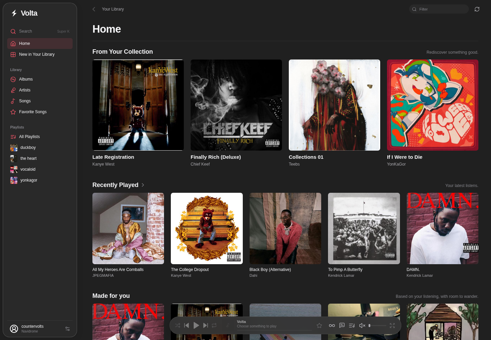
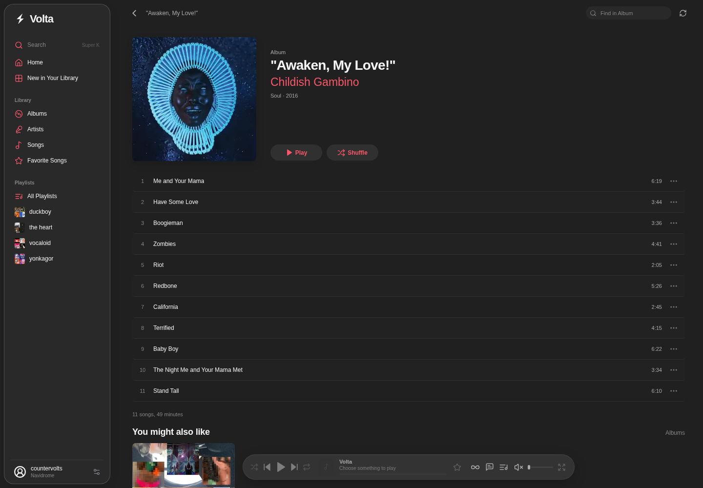
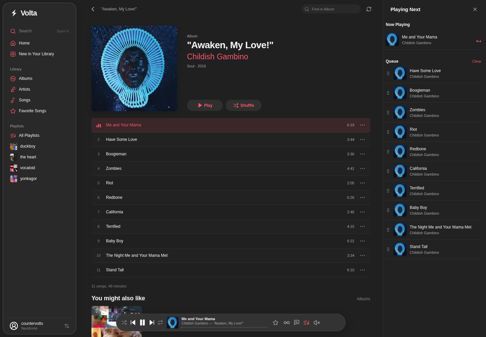
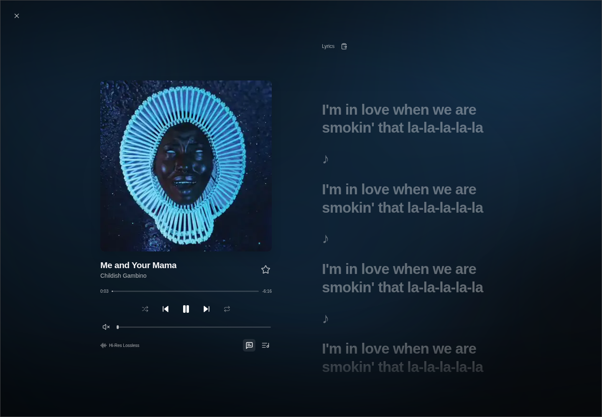

## Volta Player

Volta Player is a web music player (and self-hosted) for Navidrome and local music.
## showcase

<table>
  <tr>
    <td align="center"><br><sub><b>Home</b> · recommendations and recently played</sub></td>
    <td align="center"><br><sub><b>Album</b> · artwork, track list, and recommendations</sub></td>
  </tr>
  <tr>
    <td align="center"><br><sub><b>Queue</b> · playing next beside the album</sub></td>
    <td align="center"><br><sub><b>Synced Lyrics</b> · full-screen player with live lyrics</sub></td>
  </tr>
</table>

## check it out!

- Stable: <https://player.voltamusic.xyz>
- Beta: <https://beta-player.voltamusic.xyz>

## self-hosting

```bash
docker compose -f docker/compose.yaml up -d --build
```

Open <http://localhost:8080> and connect your Navidrome server or local files.
